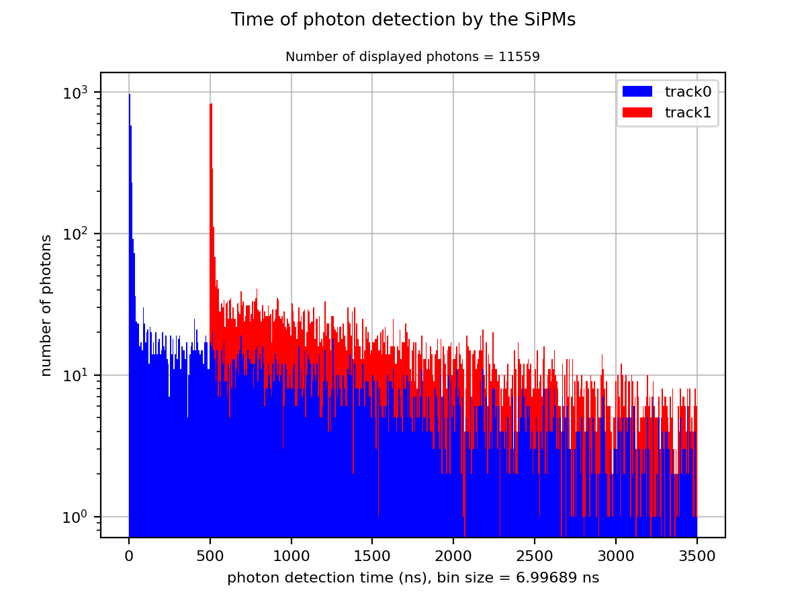

# TPCDriver
Python driver code for MATLAB TPC simulations

#### By Brandon Weiss

## Setup

First, be sure to have numpy installed. Next, install the MATLAB to python API.

**Installing the API**

Before you install, verify your Python and MATLAB configurations.
- Check that your system has a supported version of Python and MATLAB R2014b or later.
- To check that Python is installed on your system, run ```python``` at the operating system prompt.
- Add the folder that contains the Python interpreter to your path, if it is not already there. (if using MATLAB cmd prompt)
- Find the path to the MATLAB folder. Start MATLAB and type ```matlabroot``` in the command window. Copy the path returned by ```matlabroot```. It will need to be pasted when prompted with ```matlabroot``` below.

To install the engine API, choose one of the following. You must call this python install command in the specified folder.

At a Windows operating system prompt (you will need administrator privileges to execute these commands) —

``` cd "matlabroot\extern\engines\python"```

``` python setup.py install```
    
At a macOS or Linux operating system prompt (you will need administrator privileges to execute these commands) —

``` cd "matlabroot/extern/engines/python"```

``` python setup.py install```
    
At the MATLAB command prompt —

``` cd (fullfile(matlabroot,'extern','engines','python'))```

``` system('python setup.py install')```

Information regarding more details of the MATLAB to python API can be found [here](https://www.mathworks.com/help/matlab/matlab-engine-for-python.html?s_tid=CRUX_topnav).

**Get MATLAB Code**

In order to get the correct version (i.e. compatible) version of Tom Schutt's MATLAB code, please fork and clone the repository [here](https://github.com/BMDragon/LeRubik). It is a private repository, so please email either Brandon Weiss (bmweiss10@gmail.com) or Gianluca Petrillo (petrillo@slac.stanford.edu) to get access.

**Important:** Once you fork and clone this repository, make sure to change the file location on line 6 of ConfigFiles/Driver.py. The new file location should be a path to where the MATLAB code from the previous paragraph is saved. (If you want to use `../`, it seems that the location should be relative to TPCDriver, not ConfigFiles)

## Usage

#### 1. Running simulations
1. ConfigFiles/NewConfig.py\
&ndash; This is a generative script that produces a new configuration file for simulations.\
&ndash; Input: Name of the new configuration file (change on line 3, variable ```filename```).\
&ndash; Output: A blank template configuration file located inside the ConfigFiles folder.\
&ndash; Once a new configuration file is generated, the user must go in and set all the values for the variables in order to use the file correctly.

2. Configuration Files\
&ndash; Within the generated configuration file there should be comments explaining what each variable corresponds to and their "physical meaning." All units should be in mks (standard SI).\
&ndash; If saving files, make sure that a directory is created with a name that accurately reflects what you are simulating. Change the folder name on line 5 to the same name as the desired directory.\
&ndash; There is more information about allowable values in the [Configuration File details](https://github.com/BMDragon/TPCDriver#configuration-file-details) section below.\
&ndash; The last line of the configuration file should be a call to the Driver.\
&ndash; Output files will be saved to the specified directory. The saved files may include stats, signals, and/or a full record, the details of which can be found in the [Output files](https://github.com/BMDragon/TPCDriver#output-files) section.

3. Driver\
&ndash; A generalized python file which holds a function to be called by the configuration files.\
&ndash; Again, the file location on line 6 called `dataPath` should be changed to where the MATLAB code is saved.\
&ndash; The function `Drive` first unpacks configuration values while asserting that all properties used are defined in the configuration file. It then drives the MATLAB simulation as described in the [Driver details](https://github.com/BMDragon/TPCDriver#driver-details) section.\
&ndash; This file should not be run by itself.

#### 2. TimePlotter

This script will create a histogram plot of the number of photons that generated a signal at a silicon photomultiplier (SiPM) at a given time. 

Input: Line 5 (variable ```folder```) is a path to the directory where the data is located. Line 6 (variable ```numBins```) is the number of bins to have in the histogram plot. Line 7 (variable ```pltLimit```) is the max time in seconds to be plotted in the histogram. Also in line 27 (```hist, bins, patches = ax.hist(histArray, bins=numBins, color=('blue', 'red'), stacked=True)```), be sure to change the ```color``` keyword argument to have the same number of elements (specified colors) as the number of tracks in the dataset.

Output: A histogram plot of the time of signal observation by the SiPMs. The y-axis is a logarithmic scale of photon counts. The x-axis is time in nanoseconds. The script will also print into the terminal four numbers: first, the number of photons observed by the SiPMs (and thus considered for the histogram); second, the number of photons that get displayed by the histogram; third, the number of photons omitted (by the plot limit on the time axis); and last, the total number of photons that were simulated in this dataset.

#### 3. PlotPhoton

This script will create a visualization for the path that any given photon takes through the TPC. 

Input: Line 5 (variable ```photons```) is a numpy array of the photons whose path the user wants to visualize, indexed from 1 (there is no photon 0). Line 6 (variable ```folder```) is a path to the directory where the data is located. Line 7 (variable ```tpcWidth```) is the length of one side of the square base of the TPC; this should be equal to the width value used when generating the dataset. Line 8 (variable ```tpcHeight```) is the "height" of the TPC along the z-axis; this should be equal to the height value used when generating the dataset. 

Output: A 3-dimensional plot tracing the paths of photons, one at a time. The starting point (instance of scintillation) is labeled as point 0. Unshifted UV light is traced with a magenta line while shifted visible light is traced with a blue line. Diffuse reflection is marked by a gray dot while specular reflection is marked by a cyan dot. Rayleigh scattering is marked by an orange dot. Absorption back into the medium is marked by a black dot. Absoption into a surface is marked by a red dot, except for when the photon is absorbed into a SiPM *and* registers a signal, then it is marked by a green dot. These colors are customizable in lines 10-15.

#### 4. FindInfo

This is an information dumper to assist with debugging and/or understanding occurances. As such, it can be easily overhauled and modified to serve the needs of the user. For accurate results, be sure to follow the structure of the [output files](https://github.com/BMDragon/TPCDriver#output-files).

Example 1: ```photon``` and ```step``` are specified by the user, let these equal 2 and 1, respectively. The code will print into the terminal the status of photon 2 at simulation step 1.

```
dex = record['step'+str(step+1)]['status']['photon'][0].toarray().index(photon)
for key in record['step'+str(step+1)]['status']:
    print(key, record['step'+str(step+1)]['status'][key][0][dex])
```

Example 2: This will scan through all photons in step 2 and print out those that had stopped at the top of the detector in this step.

```
for ii in range(len(record['step2']['status']['stopped'][0])):
    if record['step2']['status']['stopped'][0][ii] and \
       record['step2']['status']['detectortop'][0][ii]:
        print(record['step2']['status']['photon'][0][ii])
```

## Configuration File details

#### 1. New Configuration File Generator

```filename``` should be a String that follows normal file-naming conventions. It is the name of the new config script.

If a new control feature is desired in future TPC simulations, add the control variable into the template at the desired line *and* in the dictionary and it will appear when new files are generated from this script.

#### 2. Input values

All these values get packaged into a python dictionary before calling the driver.

```saveFolder``` is the name of the folder where the data files should be saved. The directory should be manually made by the user beforehand.

```saveOptions``` is an integer in [0, 3]. 0: do not save anything. 1: save only record. 2: save record and signals. 3: save record, signals, and stats.

```height``` is a float > 0. This is the distance in meters from the cathode to the anode.

```width``` is a float > 0. This is the width of the TPC in meters. For a box, this is the legth of one side of the square base.

```wallShiftEfficiency``` is a float in [0.0, 1.0]. This is the rate of waveshifting at the walls.

```sipmShiftEfficiency``` is a float in [0.0, 1.0]. This is the rate of waveshifting at the SiPMs.

```anodeShiftEfficiency``` is a float in [0.0, 1.0]. This is the rate of waveshifting at the anode.

```detectorType``` is a String specifying the general shape of the TPC. Can have values of 'box', 'polygonal', 'cylinder', or 'cone'. However, only 'box' is compatible with the current code. Default ```'box'```.

```numSides``` is an integer >= 3. If detectorType is 'polygonal', then this determines how many wall faces the TPC will have (else it does not matter). Default ```4```.

```layerName``` is a String that will give an appropriate name to this layer. This is a legacy from Tom Shutt's MATLAB code. Default ```'cell'```.

```isLayerCone``` is a boolean. This states whether or not the layer has a conical shape. Also a legacy from Tom Schutt's MATLAB code. Default ```False```.

```medium``` is a String specifying the medium used within the TPC. Can be either 'Ar' for argon or 'Xe' for xenon. Default ```'Ar'```.

```mediumState``` is a String specyfying the state of matter of the medium within the TPC. Can be either 'liquid' or 'gas'. Default ```'liquid'```.

```temperature``` is a float > 0. This is the temperature in Kelvin of the medium inside the TPC. Default ```87.0```.

```layerWall``` is a String specifying the material of the walls. The available options are described in the [default materials](https://github.com/BMDragon/TPCDriver#4-default-materials) section below.

```wallShiftType``` is an integer in [1, 2]. 1: uniform efficiency. 2: linear z-graded efficiency. Default ```1```.

```scatterLengthUV``` is a float > 0. This is the scattering length in meters of the medium with respect to the unshifted light (UV for LAr). To set to infinity, make sure to ```import math``` at the top and set this value to ```math.inf```.

```scatterLengthShift``` is a float > 0. This is the scattering length in meters of the medium with respect to the shifted light (visible for LAr). To set to infinity, make sure to ```import math``` at the top and set this value to ```math.inf```.

```absoptionLengthUV``` is a float > 0. This is the absoption length in meters of the medium with respect to the unshifted light (UV for LAr). To set to infinity, make sure to ```import math``` at the top and set this value to ```math.inf```.

```absorptionLengthShift```  is a float > 0. This is the absoption length in meters of the medium with respect to the shifted light (visible for LAr). To set to infinity, make sure to ```import math``` at the top and set this value to ```math.inf```.

```sipmArrangement``` is a String specifying the way to organize the SiPMs. Right now, the only possible configuration is a simple square: ```'simplesquare'```.

```sipmQeUV``` is a float in [0.0, 1.0]. This is the quantum efficiency of the SiPMs with respect to the unshifted light (UV in LAr).

```sipmQeVis``` is a float in [0.0, 1.0]. This is the quantum efficiency of the SiPMs with respect to the shifted light (visible in LAr).

```sipmSize``` is a float >= 0. This is the length in meters of one side of a square SiPM. Be sure that sipmSize + sipmGapSize > 0.

```sipmGapSize``` is a float >= 0. This is the distance in meters in between adjacent sides of neighboring SiPMs. i.e. sipmSize + sipmGapSize = the center-to-center distance of neighboring SiPMs. Be sure that sipmSize + sipmGapSize > 0.

```sipmMaterial``` is a String specifying the material of the SiPMs. The available options are described in the [default materials](https://github.com/BMDragon/TPCDriver#4-default-materials) section below, although it is highly suggested to use silicon ```'si'```.

```gapMaterial``` is a String specifying the material of the gaps in the cathode. The available options are described in the [default materials](https://github.com/BMDragon/TPCDriver#4-default-materials) section below.

```anodeType``` is a String specifying the type of surface of the anode. Default ```'plate'```.

```anodeMaterial``` is a String specifying the material of the anode. The available options are described in the [default materials](https://github.com/BMDragon/TPCDriver#4-default-materials) section below.

```tracks``` is a dictionary of a String key and a list of tuplets value. The key should be a String which will end up being the name of the track. The value should be a list of two tuplets: the first being a tuplet of 4 floats representing the starting position (x1, y1, z1, t), the second being a tuplet of 3 floats representing the end position (x2, y2, z2). End time is calculated from particle speed in the Driver. Be sure that x1, x2, y1, y2 in [-width/2, width/2]; z1, z2 in [0, height]; and t >= 0.

Example tracks declaration:

```
tracks = {'track0' : [(-0.1, 0.15, 0.23, 0.), (-0.1, -0.13, 0.3)],
          'track1' : [(0.1, -0.15, 0.1, 5e-7), (0.1, 0.15, 0.05)]}
```

```angleMode```

```theta```

```phi```

```numPhotonsScale```

#### 3. Overwriting properties

```overwrite```

```overwriteProperties```

#### 4. Default Materials


## Driver details

#### 1. Unpacking and repackaging values


#### 2. MATLAB handling


#### 3. Overwriting material properties


#### 4. Calls to MATLAB preprocessing


#### 5. Determining photon distribution


#### 6. Determining photon starting positions


#### 7. Running Simulation in MATLAB


#### 8. Scintillation time delays


## Output files

#### 1. Stats


#### 2. Signals


#### 3. Records


## Limitations

Assumes MIP

Assumes particle travels at near speed of light (299,792,457 m/s)
